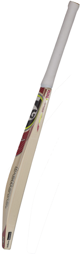

# CSS Animation or CSS3 Animation

### Cricket match animation using transition and transform

```css
.field {
  border-right: 25px dotted lightcoral;
  width: 1000px;
}
.bat {
  transition: transform 0.2s ease-in;
}
.field:hover .bat {
  transform: rotate(-35deg);
  transform-origin: top right;
}

.ball {
  width: 50px;
  height: 50px;
  background-color: rgb(224, 22, 22);
  border-radius: 50%;
  position: relative;
  left: 316px;
  bottom: 75px;
  transition: transform 1s ease-out 0.2s;
}
.field:hover .ball {
  transform: translate(800px, -70px);
}
```

```html
<!DOCTYPE html>
<html lang="en">
  <head>
    <meta charset="UTF-8" />
    <meta http-equiv="X-UA-Compatible" content="IE=edge" />
    <meta name="viewport" content="width=device-width, initial-scale=1.0" />
    <title>Cricket match animation using transition and transform</title>
    <link rel="stylesheet" href="style.css" />
  </head>
  <body>
    <div class="field">
      
      <div class="ball"></div>
    </div>
  </body>
</html>
```
